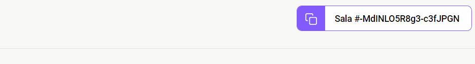

# Sobre
<p align="center">

</p>

## Projeto realizado com a instrução da empresa de tecnologias Rocketseat. Evento NLW-Together

# Interface
## Caso a sala ja exista, basta digitarmos o código na caixa de texto abaixo e entrar na sala
</br>
<p align="center">

</p>

## Caso a sala não exista, basta clicarmos no botâo do Google, realizar o login e criar a sala
</br>
<p align="center">

</p>
</br>

## Após o login, o usuário será redirecionado para a sala
</br>

<p align="center">

</p>
</br>

## Digitando sua primeira pergunta:
</br>
<p align="center">

</p>
</br>

## Após o envio da pergunta, a mesma será renderizada na tela:
</br>
<p align="center">

</p>
</br>

# Botão para copiar o código da sala
<p align="center">

</p>

# Como baixar o projeto

```
    $ git clone https://github.com/Giovani2912/letmeask.git

    $ cd letmeask

    $ yarn add

    $ yarn start
```

# Layout
- Você pode ver o layout do projeto [aqui](https://www.figma.com/file/u0BQK8rCf2KgzcukdRRCWh/Letmeask/duplicate?node-id=0%3A1)